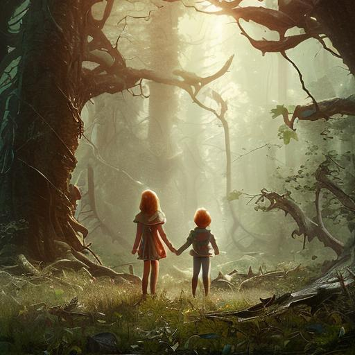
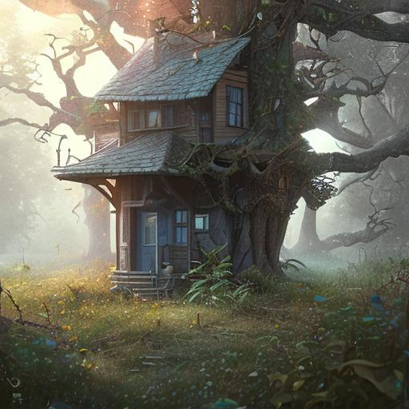
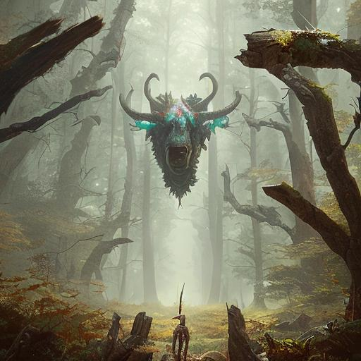

# Utopia 2300

https://utopia.vinc.cc

[ChatGPT][1] and [OpenJourney][2] were asked to halucinate for us a future from the year
2300, two centuries after human population peaked, where half of the land was
set aside for nature and humans became steward of the land after organizing
themselves into post-scarcity anarchist communities.

## Prompts

Here's a few examples of prompts for OpenJourney:

- mdjrny-v4 style offroad bus on a path in a cyberpunk village with lots of trees, digital painting, matte painting, concept art, greg rutkowski
- mdjrny-v4 style bazaar with neon lights in the middle of a jungle, digital painting, matte painting, concept art, greg rutkowski
- mdjrny-v4 style scientists working in a lab in a greenhouse, digital painting, matte painting, concept art, greg rutkowski
- mdjrny-v4 style congregation of monks next to a temple in the forest, digital painting, matte painting, concept art, greg rutkowski

## Thanks

Thanks to the AI that dreamed this vision and the humans that trained them.

[1]: https://chat.openai.com/
[2]: https://www.openjourney.art/
